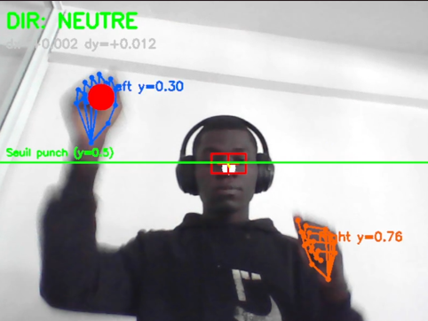
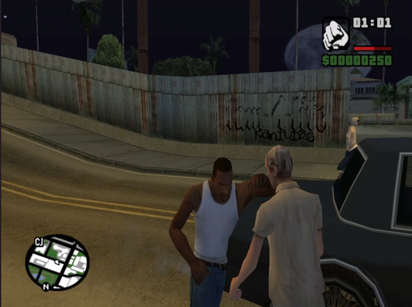

# 🎮 GTA Gesture Control — Play GTA San Andreas With Your Body

<div align="center">


**Control CJ in GTA San Andreas using only your webcam — no controller, no keyboard.**

Turn your head to move. Throw punches to fight. Just like real life.

</div>

---

## 🎬 Demo

<div align="center">

<video src="https://raw.githubusercontent.com/NdandaClaude/gta-gesture-control/main/assets/demo.mp4" controls autoplay muted loop width="600"></video>

*Real-time gesture detection controlling GTA San Andreas*

</div>

| Detection View | In-Game Result |
|:-:|:-:|
|  |  |

---

## 🧠 How It Works

The script uses **two AI models** running in real-time on your webcam:

```
┌─────────────┐     ┌──────────────────┐     ┌─────────────┐
│   Webcam     │────▶│  MediaPipe Pose   │────▶│  Head → WASD │
│   (30 FPS)   │     │  (Nose tracking)  │     │  Movement    │
└─────────────┘     └──────────────────┘     └─────────────┘
       │
       │            ┌──────────────────┐     ┌─────────────┐
       └───────────▶│  MediaPipe Hands  │────▶│  Punch → CTRL│
                    │  (2 hands)        │     │  Attack      │
                    └──────────────────┘     └─────────────┘
```

### Controls

| Gesture | Key | GTA Action |
|---------|-----|------------|
| 🔄 Turn head **left** | `A` | Move left |
| 🔄 Turn head **right** | `D` | Move right |
| 🔽 Tilt head **forward** | `W` | Walk forward |
| 🔼 Tilt head **back** | `S` | Walk backward |
| 👊 Raise **left hand** | `Left Ctrl` | Punch / Attack |
| 👊 Raise **right hand** | `Left Ctrl` | Punch / Attack |

### Visual Feedback

| Element | Description |
|---------|-------------|
| ⚪ White dot | Your nose position (current) |
| ❌ Red cross | Calibrated neutral position |
| 🟥 Red rectangle | Dead zone (no movement) |
| 🟡 Yellow line | Vector from neutral → current nose |
| 🟢 Green line | Punch detection threshold |
| 📝 `DIR: W D` | Active direction keys |

---

## 🚀 Quick Start

### Prerequisites

- **Python 3.8+**
- **Webcam**
- **Windows** (uses `pydirectinput` for DirectX key simulation)
- **GTA San Andreas** installed

### Installation

```bash
# Clone the repository
git clone https://github.com/NdandaClaude/gta-gesture-control.git
cd gta-gesture-control

# Install dependencies
pip install -r requirements.txt
```

> **Note:** The MediaPipe AI models (`hand_landmarker.task` and `pose_landmarker.task`) are downloaded **automatically** on first run.

### Usage

1. **Launch GTA San Andreas**
2. **Run the script:**
   ```bash
   python gta_control.py
   ```
3. **Stand in front of your webcam** — stay still for 3 seconds (calibration)
4. **Play!** Turn your head to move, punch with your hands to fight
5. Press **`Q`** in the detection window to quit

---

## 📁 Project Structure

```
gta-gesture-control/
├── gta_control.py          # Main script — gesture detection + game control
├── requirements.txt        # Python dependencies
├── launch_gta_windowed.bat # Optional: launch GTA in windowed mode
├── assets/                 # Screenshots and demo media
│   ├── demo.gif
│   ├── screenshot_detection.png
│   ├── screenshot_game.png
│   └── screenshot_combined.png
├── LICENSE                 # MIT License
└── README.md               # This file
```

---

## ⚙️ Configuration

All thresholds are adjustable at the top of `gta_control.py`:

### Head Movement (lines 70-71)
```python
HEAD_X_THRESHOLD = 0.04   # Left/Right sensitivity (lower = more sensitive)
HEAD_Y_THRESHOLD = 0.03   # Forward/Back sensitivity
```

### Punch Detection (lines 48-51)
```python
PUNCH_Y_THRESHOLD = 0.5   # Hand must be above this line to trigger
PUNCH_COOLDOWN = 0.15     # Min delay between punches (seconds)
```

### Smoothing (line 81)
```python
SMOOTH_FACTOR = 0.7       # 0 = instant response, 1 = very smooth (slower)
```

---

## 🛠️ Tech Stack

| Technology | Usage |
|-----------|-------|
| [MediaPipe](https://mediapipe.dev/) | Pose estimation (nose tracking) + Hand landmark detection |
| [OpenCV](https://opencv.org/) | Webcam capture, video display, visual feedback |
| [pydirectinput](https://github.com/learncodebygaming/pydirectinput) | DirectX key simulation (works with fullscreen games) |
| [NumPy](https://numpy.org/) | Calibration data processing |

---

## 💡 Tips

- **Calibration matters:** Stand straight and look directly at the camera during the 3-second calibration
- **Lighting:** Good lighting helps MediaPipe detect your face and hands more accurately
- **Distance:** Sit/stand about **50-80 cm** from the webcam for best results
- **If movement is too sensitive:** Increase `HEAD_X_THRESHOLD` and `HEAD_Y_THRESHOLD`
- **If punches don't register:** Lower `PUNCH_Y_THRESHOLD` (e.g., from `0.5` to `0.6`)
- **GTA key bindings:** Make sure your GTA SA attack key is set to **Left Ctrl** (default)

---

## 📹 Recording a Demo (with OBS Studio)

1. Download [OBS Studio](https://obsproject.com/)
2. Add sources:
   - **Game Capture** → GTA San Andreas
   - **Window Capture** → "GTA Control - Gesture Detection" (the OpenCV window)
3. Resize the detection window to a corner
4. Hit **Start Recording** and play!

---

## 🤝 Contributing

Contributions are welcome! Some ideas:

- [ ] Add sprint gesture (e.g., both hands raised)
- [ ] Add jump gesture
- [ ] Add mouse look control with head
- [ ] Support other GTA versions (Vice City, GTA V)
- [ ] Add voice commands
- [ ] Linux/macOS support

---

## 📄 License

This project is licensed under the MIT License — see the [LICENSE](LICENSE) file for details.

---

<div align="center">

**Made by [NdandaClaude](https://github.com/NdandaClaude) with 🎮 and 🤖**

*If you liked this project, give it a ⭐ on GitHub!*

</div>
